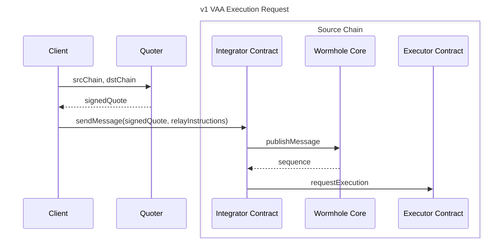
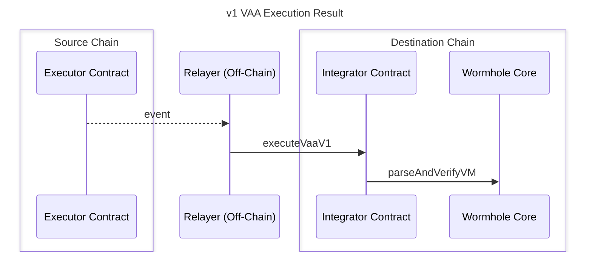

# Executor

## Objective

Provide an execution framework for [Wormhole](https://github.com/wormhole-foundation/wormhole) and potentially other protocols that is permissionless, extensible, and low-overhead.

## Runtime Support

- [x] [EVM](./evm/)
- [x] [SVM](./svm/)
- [x] [Sui Move](./sui/)
- [x] [Aptos Move](./aptos/)

## Protocol Support

- [x] [CCTP v1](https://developers.circle.com/cctp)
- [x] [CCTP v2](https://developers.circle.com/cctp)
- [x] [NTT v1](https://github.com/wormhole-foundation/native-token-transfers)
- [x] [VAA v1](https://wormhole.com/docs/products/messaging/overview/)

## Background

Wormhole integrators rely on [various relayers](https://wormhole.com/docs/learn/infrastructure/relayer/) to complete cross-chain actions on behalf of users. The existing systems have some drawbacks however. [Wormhole Relayers](https://wormhole.com/docs/build/contract-integrations/wormhole-relayers/) introduce a significant cost overhead to achieve their goals while custom relayers introduce significant bespoke work for integrators aiming to avoid that overhead.

## Goals

- Execute [Endpoint](https://github.com/wormholelabs-xyz/example-messaging-endpoint) messages, v1 VAAs, and potential future message types.
- Minimize additional integrator and end-user cost incurred by requesting and completing execution.
- Shared on-chain code must be permissionless, non-upgradeable, and non-administered.
- The solution must be extensible to new runtimes and message types.
- Initial support for EVM, Solana, Aptos, and Sui.

## Non-Goals

- Multiple contract calls / instructions.
- Multiple messages in one execution.
- Accept non-native fee payments.
- Support arbitrary quoting signatures / mechanisms.

## Overview





## Detailed Design

Fundamentally, this design offers a re-imagining of servicing similar goals as Wormhole Relayers, namely:

- A decentralized way to facilitate the delivery of verifiable messages
- An on-chain API to request delivery of and receive messages

However, in an effort to drastically reduce costs for relayers, integrators, and end-users, as well as increase flexibility, the on-chain footprint will be significantly reduced.

- No additional on-chain state required
- Minimal on-chain verification for requests
- Transparent off-chain quotes

### Technical Details

#### Terminology

Relay Provider - The off-chain party to perform message execution.

Executor Contract - The shared, on-chain contract/program used to make Execution Requests.

Execution Quote - A quote for execution for a given source and destination chain. Quotes are signed by the Quoter.

Execution Request - A request generated on-chain or off-chain for a given message (e.g. NTT, VAA v1, etc) to be executed on another chain.

Quoter - An off-chain service which provides pricing for execution. A Relay Provider is uniquely identified by their Quoter’s EVM public key.

Payee - The wallet address on the source chain, designated by the Quoter, to receive funds when requesting an execution.

#### Relay Provider

Each independent party who wants to serve as a Relay Provider MUST run at least one Quoter service. This service provides signed quotes between source and destination chain gas. It includes an expiry time, before which the quote will be accepted by the Executor Contract. This allows a Relay Provider to limit the risk of stale quotes to a short time frame. Setting this to a short time in the future should be balanced against the ability of end-users to land transactions on the source chain within that amount of time - e.g. if set to 1 minute, it may not be possible for end-users to land a transaction on Ethereum within 1 minute of fetching the quote.

A Relay Provider MAY manage any number of wallets to perform execution, and they MAY have the Quoter balance between using those wallets as the `payeeAddress` or they MAY collect payments in a separate address entirely.

A Relay Provider SHOULD provide a public API for reporting the status of an Execution Request, including

- the time and transaction in which the request was initiated and its details
- the time and transactions of any Add Gas events associated with the request and their details
- the time and transactions of the execution associated with the request
- the time and transactions of any refunds associated with the request (or reason for a lack of refund) and their amounts

A Relay Provider SHOULD publish a service-level agreement (SLA) for execution and refunds. For example

- What type of executions do they support?
- How long will they attempt valid execution requests for?
- Under what conditions will they refund fees?
- How, exactly, will they attempt to execute each type of request?

A Relay Provider MUST watch for or otherwise status:

- Request for Execution events in order to perform the requested executions per their SLA.
- Add Relay Instructions events in order to support providing additional payment for transactions which are invalid due to underpayment or fail due to insufficient gas errors.

> 💡 Note: There is no inherent on-chain protection against repeating relay attempts. Such a mechanism is entirely up to the discretion of the Relay Provider.

#### Executor Contract

On every supported chain, there will exist a stateless, permissionless, Executor Contract which can be used to make an Execution Request given an Execution Quote.

The Executor Contract MUST support the following methods

- `requestExecution(dstChain, dstAddr, refundAddr, signedQuote, request, relayInstructions)`
  - This method is intended for on-chain or off-chain integration to request initial execution
  - MUST ensure the quote’s source chain matches its chain
  - MUST ensure the quote’s destination chain matches the requested destination chain
  - MUST ensure the quote’s expiry time has not passed
  - MUST transfer the payment to the designated `payeeAddress`
  - MUST make these inputs available for off-chain consumption (e.g. emit a Request for Execution event)
- `addRelayInstructions(requestId, refundAddr, signedQuote, relayInstructions)` [WIP]
  - This method is intended for off-chain integration to add additional instructions and/or payment in the event that the initial request was underpaid or underpriced (e.g. too low of a gasLimit)
  - MUST meet all the requirements of `requestExecution`

In order to minimize cost, this contract MUST NOT verify the signature on the Quote. The Quote SHOULD be verified by the submitting client code before being used in a transaction.

In order to be extensible, this contract MUST NOT construct or validate the message-specific request details (e.g. NTT, VAA v1, etc). It is up to the client to select an Executor which services the specific message types required.

Similarly, this contract MUST NOT check the payment amount against the quote and relay instructions. It is up to the client to accurately estimate the required payment and the relayer to enforce it.

### Protocol Integration

The API spec (TBD) for the off-chain service should be adhered to by all Relay Providers for ease of integration.

Explorers should be updated to track execution requests and link to their designated provider via quoter address.

## API Documentation

The Messaging Executor provides HTTP APIs for interacting with the relay service. The API specification is defined using [TypeSpec](https://typespec.io/) and can be generated as OpenAPI documentation.

### Building API Documentation

```bash
# Navigate to the api-docs directory
cd api-docs

# Install dependencies
npm ci

# Compile TypeSpec to generate OpenAPI spec and JS client & models
npm run compile
# or
tsp compile .
```

This will generate:

- **OpenAPI Specification**: `tsp-output/schema/openapi.yaml`
- **JavaScript Client & Models**: `tsp-output/clients/js/`

### Viewing API Documentation

After building, you can view the API documentation using:

1. **Swagger Editor** (Online)

   - Visit https://editor.swagger.io/
   - Copy and paste the contents of `tsp-output/schema/openapi.yaml`

2. **Redoc** (Online)
   - Visit https://redocly.github.io/redoc/
   - Upload your `openapi.yaml` file

### API Endpoints

The API provides three main endpoints:

#### GET `/capabilities`

Returns the capabilities for all supported chains, including:

- Supported request prefixes (ERV1, ERN1, ERC1, ERC2)
- Gas limits and message value limits
- Supported destination chains

#### POST `/quote`

Generates a signed quote for cross-chain execution:

- **Request**: Source chain, destination chain, optional relay instructions
- **Response**: Signed quote and estimated cost

#### POST `/status/tx`

Retrieves the status of an execution request:

- **Request**: Transaction hash and optional chain ID
- **Response**: Relay transaction details including status, costs, and execution results

### Using the JavaScript Client

The generated JavaScript client can be used to interact with the API programmatically:

```javascript
// Import the generated client
import { Client } from "./api-docs/tsp-output/clients/js";

// Create a client instance
const client = new Client({ baseUrl: "http://localhost:3000/v0" });

// Get capabilities
const capabilities = await client.capabilities.list();

// Generate a quote
const quote = await client.quote.create({
  srcChain: 1,
  dstChain: 2,
  relayInstructions: "0x...",
});

// Check transaction status
const status = await client.status.getTransaction({
  txHash: "0x...",
  chainId: 1,
});
```

### API / Database Schema

#### Off-Chain Quote

##### Signed Quote Header

The quote header is parsed on-chain by the Executor Contract and MUST NOT be changed across versions

```solidity
bytes4  prefix;           // 4-byte prefix for this struct
address quoterAddress;    // The public key of the quoter. Used to identify an execution provider.
bytes32 payeeAddress;     // UniversalAddress of a payee for the quoter on the sending chain.
uint16  sourceChain;      // Wormhole Chain ID
uint16  destinationChain; // Wormhole Chain ID
uint64  expiryTime;       // The unix time, in seconds, after which this quote should no longer be considered valid for requesting an execution
```

##### Signed Quote - Version 1 [WIP]

```solidity
Header   header              // prefix = "EQ01"
uint64   baseFee             // The base fee, in sourceChain native currency, required by the quoter to perform an execution on the destination chain
uint64   destinationGasPrice // The current gas price on the destination chain
uint64   sourcePrice         // The USD price, in 10^10, of the sourceChain native currency
uint64   destinationPrice    // The USD price, in 10^10, of the destinationChain native currency
[65]byte signature           // Quoter's signature of the previous bytes
```

#### Request For Execution

##### VAA v1 Request

```solidity
bytes4  prefix = "ERV1" // 4-byte prefix for this struct
uint16  emitterChain
bytes32 emitterAddress
uint64  sequence
```

##### NTT v1 Request

```solidity
bytes4  prefix = "ERN1" // 4-byte prefix for this struct
uint16  srcChain
bytes32 srcManager
bytes32 messageId
```

##### CCTP v1 Request

```solidity
bytes4  prefix = "ERC1" // 4-byte prefix for this struct
uint32  sourceDomain
uint64  nonce
```

##### CCTP v2 Request

```solidity
bytes4  prefix = "ERC2" // 4-byte prefix for this struct
uint8   autoDiscover    // Currently, must be one.
```

#### Relay Instructions

##### Gas Instruction

```solidity
uint8   type = 1
uint128 gasLimit
uint128 msgValue
```

##### Gas Drop-Off Instruction

```solidity
uint8   type = 2
uint128 dropOff
bytes32 recipient
```

## Caveats

This design is intended to be extensible and forward-compatible. In service of this, it trades on-chain complexity for off-chain flexibility. It is recommended that only the Request For Execution messages be generated on-chain, as it may not be possible to foresee the nuances of every foreign chain requirement. For example, there may be changes to the gasLimit required by another chain after an upgrade, and it would likely be preferable to only have to make off-chain changes to support it.

The signed quote format above, designated `EQ01`, designates a flat fee for a pair of source and destination chains. It does not take into account the type of message being relayed or the contents of that message. This design does not prohibit Relay Providers from offering other quote formats, as long as they adhere to the same header.

## Alternatives Considered

### On-Chain Quoting

Maintaining up-to-date quotes on-chain while providing cost guarantees would require exponential (n^2) updates per supported chain while adding significant Relay Provider cost to maintain them. Even still, it would not inherently allow for cost guarantees due to the delay between an end-user signing a transaction and that transaction being included in a block. This design allows for such a guarantee without any overhead because the quote is provided up front, valid for a limited time, and can be verified off-chain.

## Security Considerations

Unlike the [Wormhole Relayer](https://wormhole.com/docs/build/contract-integrations/wormhole-relayers/) contract, the Executor Contract is explicitly designed to be immutable and sit outside an integrator's security stack. Executor is designed to be used as a mechanism to permissionlessly deliver cross-chain data that includes an independent attestation source, such as Wormhole v1 VAAs.
