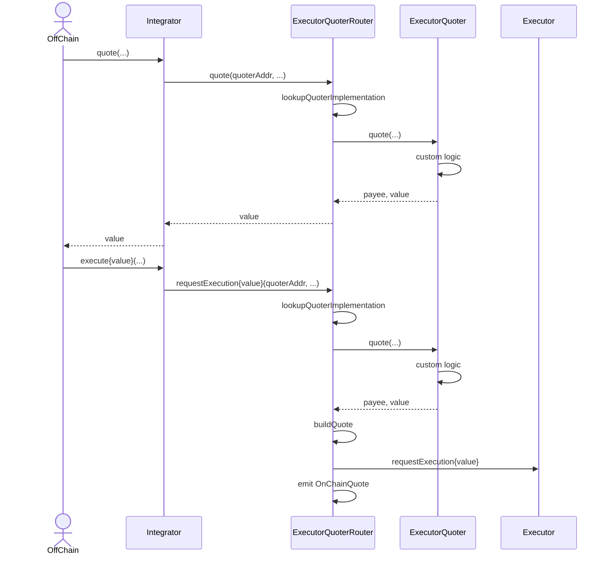

# Executor On-Chain Quotes

# Objective

Some would-be Executor integrators may need on-chain quotes as they do not necessarily control the end-user flow or integration API to their contracts. This design proposes a solution which can allow for the on-chain resolution they require without sacrificing the original motivations of the Executor design.

## Runtime Support

- [x] [EVM](./evm/)
- [x] [SVM](./svm/)

# **Background**

The initial [Executor](../README.md) design requires passing a quote to the on-chain contract which was intended to be passed by the off-chain caller, fetched from an Executor service provider. This quote must comply with a specific [header format](../README.md#off-chain-quote) but may otherwise contain any data specified by the Relay Provider. It was also recommended to perform the gas calculation off-chain. All this was done in service of reducing operational costs and on-chain complexity. Notably, the quote contains an expiry - the Executor on-chain contract enforces that a quote can not be used after its expiry.

This approach worked for use cases where the UI can be changed to accommodate the new requirements. However, some integrators are composing with other protocols with pre-established APIs. They require an approach which only relies on on-chain state.

EVM integrators may be familiar with a common pattern used by other on-chain services of having one `view` function to quote and another `payable` function to execute. For example, [NTT](https://github.com/wormhole-foundation/native-token-transfers) requires this on-chain pattern in its [Transceiver](https://github.com/wormhole-foundation/native-token-transfers/blob/c4db04fcbee08dd474d40c9bc121dbb701b3a535/evm/src/interfaces/ITransceiver.sol#L49-L73) in order to split a `msg.value` across multiple Transceivers.

# **Goals**

- Provide a new mechanism for requesting execution on-chain that is compatible with the existing Executor contract and does not require additional parameters to be passed from off-chain.
- Do not substantially increase the operational cost or complexity of operating an Executor Relay Provider.
- Maintain compatibility with the existing Executor design. This includes the key principles of permissionlessness and immutability.

# Non-Goals

- Support the same on-chain API as another relaying service or a particular EIP.
- Pricing mechanisms for generating quotes or appraising relay costs.
- Supporting non native gas token payments.

# **Overview**



# Detailed Design

The existing Executor contracts are immutable, handle payment in the native gas token, and require a standardized quote header. This design introduces and standardizes the minimum viable approach to form quotes on-chain, allow for permissionless quoter selection, and reuse the rest of the on- and off-chain tooling.

## Technical Details

### EVM

On EVM, two new contracts will be introduced.

1. **ExecutorQuoter** represents the on-chain quoting logic of a particular Quoter / Relay Provider. It may implement any logic desired by the Relay Provider as long as it adheres to this interface. It SHOULD be immutable.

```solidity
interface IExecutorQuoter {
    /// This method is used by on- or off-chain services which need to determine the cost of a relay
    /// It only returns the required cost (msg.value)
    /// It is explicitly marked view
    function requestQuote(
        uint16 dstChain,
        bytes32 dstAddr,
        address refundAddr,
        bytes calldata requestBytes,
        bytes calldata relayInstructions
    ) external view returns (uint256 requiredPayment);
    /// This method is used by an ExecutorQuoterRouter during the execution flow
    /// It returns the required cost (msg.value) in addition to the payee and EQ02 quote body
    /// It is explicitly NOT marked view in order to allow the quoter the flexibility to emit events or update state
    function requestExecutionQuote(
        uint16 dstChain,
        bytes32 dstAddr,
        address refundAddr,
        bytes calldata requestBytes,
        bytes calldata relayInstructions
    ) external returns (uint256 requiredPayment, bytes32 payeeAddress, bytes32 quoteBody);
}
```

2. **ExecutorQuoterRouter** replaces **Executor** as the entry-point for integrators. It MUST be immutable and non-administered / fully permissionless. This provides three critical functionalities.
   1. `updateQuoterContract(bytes calldata gov)` allows a Quoter to set their `ExecutorQuoter` contract via signed governance (detailed below). This MUST
      1. Verify the chain ID matches the Executor’s `ourChain`.
      2. Verify the contract address is an EVM address.
      3. Verify the sender matches the sender on the governance.
      4. Verify the governance has not expired.
      5. Verify the signature `ecrecover`s to the quoter address on the governance.
      6. Assign the specified contract address to that quoter address.
      7. Emit a `QuoterContractUpdate` event (on applicable runtimes, e.g. EVM).
   2. `quoteExecution` allows an integrator to quote the cost of an execution for a given quoter in place of a signed quote. This MUST call `requestQuote` from that Quoter’s registered contract.
   3. `requestExecution` allows an integrator to request execution via Executor providing a quoter address in place of a signed quote. This MUST
      1. Call `requestExecutionQuote` from that Quoter’s registered contract.
      2. Enforce the required payment.
      3. Refund excess payment.
      4. Request execution, forming a `EQ02` quote on-chain.
      5. Emit an `OnChainQuote` event (on applicable runtimes, e.g. EVM).

```solidity
interface IExecutorQuoterRouter {
    event OnChainQuote(address implementation);
    event QuoterContractUpdate(address indexed quoterAddress, address implementation);

    function quoteExecution(
        uint16 dstChain,
        bytes32 dstAddr,
        address refundAddr,
        address quoterAddr,
        bytes calldata requestBytes,
        bytes calldata relayInstructions
    ) external view returns (uint256);

    function requestExecution(
        uint16 dstChain,
        bytes32 dstAddr,
        address refundAddr,
        address quoterAddr,
        bytes calldata requestBytes,
        bytes calldata relayInstructions
    ) external payable;
}
```

### SVM

On SVM, two programs are introduced.

1. **ExecutorQuoter** is a Pinocchio-based program that implements the quoting logic. It exposes two CPI-callable instructions:
   - `RequestQuote` (discriminator `[2, 0, 0, 0, 0, 0, 0, 0]`): Returns `(payee_address, required_payment)` via return data.
   - `RequestExecutionQuote` (discriminator `[3, 0, 0, 0, 0, 0, 0, 0]`): Returns `(required_payment, payee_address, quote_body)` as 72 bytes via return data.

   The quoter reads pricing data from on-chain PDAs (`ChainInfo`, `QuoteBody`) maintained by an authorized updater.

2. **ExecutorQuoterRouter** is the entry-point for integrators. It provides three instructions:
   1. `UpdateQuoterContract` registers or updates a quoter's implementation mapping. This MUST:
      - Verify the chain ID matches `OUR_CHAIN`.
      - Verify the sender matches `universal_sender_address` in the governance message.
      - Verify the governance has not expired.
      - Verify the secp256k1 signature recovers to the quoter address (20-byte EVM address).
      - Create or update a `QuoterRegistration` PDA seeded by `["quoter_registration", quoter_address]`.

   2. `QuoteExecution` gets a quote from a registered quoter via CPI. The quoter's return data is forwarded to the caller.

   3. `RequestExecution` requests execution through the router. This MUST:
      - CPI to the quoter's `RequestExecutionQuote` to get payment/payee/quote body.
      - Verify payment amount is sufficient.
      - Construct an `EQ02` signed quote on-chain.
      - CPI to Executor's `request_for_execution`.

   **Account Handling**: The router uses a fixed account layout for quoter CPIs. The quoter accounts (`config`, `chain_info`, `quote_body`) are passed by the client and forwarded to the quoter program. This allows different quoter implementations to use different account structures while maintaining a standardized router interface.

   **Quoter Identity**: Quoters are identified by their 20-byte EVM address (derived from secp256k1 public key). The `QuoterRegistration` PDA maps this address to a Solana program ID that implements the quoting logic.

### Other

Other platforms are not in-scope at this time, but similar designs should be achievable.

## Protocol Integration

Relay Providers will need to change their verification for Executor requests. If the prefix is [`EQ02`](#quote---version-2-eq02), they MUST check the following event to ensure it is an `OnChainQuote` emitted by the canonical `ExecutorQuoterRouter` on that chain in place of verifying the signature.

Since the 32 byte body from `EQ01` is added, no additional changes will be required apart from the above.

## **API / database schema**

### Governance

This design introduces a new concept of a Quoter’s on-chain governance.

The governance includes a sender address and expiry time in order to prevent replay attacks in lieu of a nonce and hash storage. The intention being that a short enough expiry time along with a pre-designated submitter mitigates the event where a quoter could be rolled back to a previous implementation by replaying their governance even when two governance messages are generated in short succession.

```solidity
bytes4  prefix = "EG01";  // 4-byte prefix for this struct
uint16  sourceChain;      // Wormhole Chain ID
address quoterAddress;    // The public key of the quoter. Used to identify an execution provider.
bytes32 contractAddress;  // UniversalAddress the quote contract to assign.
bytes32 senderAddress;    // The public key of address expected to submit this governance.
uint64  expiryTime;       // The unix time, in seconds, after which this quote should no longer be considered valid for requesting an execution
[65]byte signature        // Quoter's signature of the previous bytes
```

### Quote - Version 2 (EQ02)

This introduces a new Quote version to the [Executor spec](../README.md#api--database-schema). It has the same body as `EQ01` sans signature. This is useful for parsing and validating off-chain.

```solidity
Header   header              // prefix = "EQ02"
uint64   baseFee             // The base fee, in sourceChain native currency, required by the quoter to perform an execution on the destination chain
uint64   destinationGasPrice // The current gas price on the destination chain
uint64   sourcePrice         // The USD price, in 10^10, of the sourceChain native currency
uint64   destinationPrice    // The USD price, in 10^10, of the destinationChain native currency
```

# **Caveats**

Integrators MAY now choose to construct their relay instructions on-chain. They will need to manage how to handle challenging cross-chain situations, such as calculating the required rent on SVM or gas usage differences across different EVMs.

Unlike the off-chain signed quote, there may be a price update for the on-chain quote between when the client code requests the quote and when the transaction is executed on the source chain. This may cause the transaction to fail if the price increased during that time period and a sufficient buffer was not added to the quote.

# **Alternatives Considered**

## Subscriptions

A separate design where integrators pay for Executor costs via a subscription model was proposed, but this exposes a severe DoS risk where integrators incur arbitrary costs effectively controlled by end users if messaging is permissionless. Instead, this design maintains the costs with end users, keeping the risk equivalent.

## ExecutorV2

It is possible to keep the same or similar interface as Executor in the ExecutorQuoterRouter contract and allow the client to toggle between on- or off- chain quotes based on the first 4 bytes of the quote passed. This is still possible to add an additional wrapper around in the future, though would involve another contract. It is not immediately clear if there are integrators that would desire such flexibility.

## ExecutorQuoter ABI

While it was not strictly necessary to return the quote body for on-chain execution purposes, it is useful for off-chain integrations to validate and display price information. In order to slightly reduce costs and allow the quoter contract to differentiate between the quote and execute paths, two different functions are used with different modifiers and return values.

# **Security Considerations**

The `ExecutorQuoterRouter` remains permissionless and any Quoter can freely register/update and implement their own `ExecutorQuoter` implementation. The only change in the trust assumption for the Relay Provider is that they previously only relied on a given chain’s RPC implementation and their RPC provider in regards to the request for execution event and amount paid. Now they may also trust the resulting quote and required payment, as it is not signed by their Quoter.

The `ExecutorQuoterRouter`, plays a critical role in its emission of an event to ensure to off-chain services that the unsigned `EQ02` quote was formed by the designated Quoter’s registered `ExecutorQuoter` implementation.
