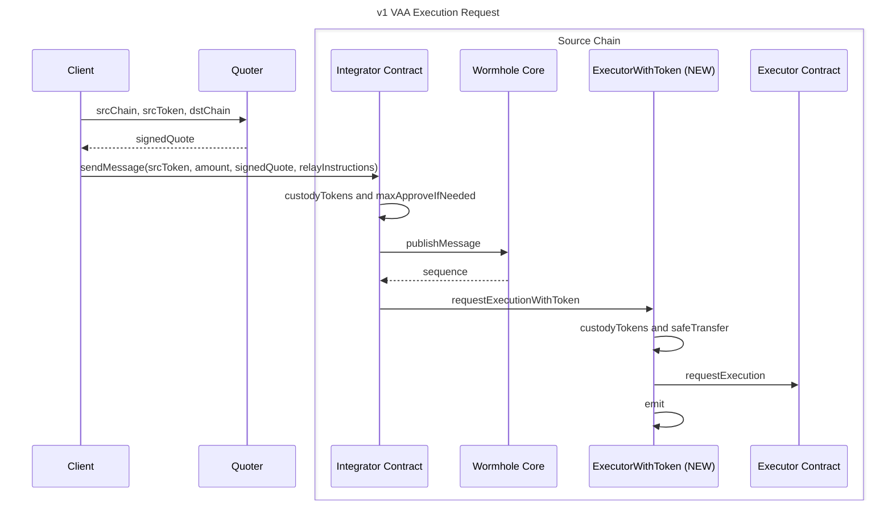

# Executor Source Token Quotes

## Objective

Some users or Executor integrators may wish to pay fees in a token other than the gas token of a chain. For example, they may wish to pay in USDC rather than ETH on Ethereum. This design proposes a solution which can allow for the Quoter to indicate a specific source chain token the quote is for along with a contract integration to facilitate payment.

### Runtime Support

- [x] [EVM](../evm/)

## Background

The initial [Executor](../README.md) design explicitly specified payment in the source chain's native currency. A quote must comply with a specific [header format](../README.md#off-chain-quote) but may otherwise contain any data specified by the Relay Provider.

## Goals

- Provide a new Quote specification to support arbitrary token payments.
- Support non native gas token payments.
- Maintain compatibility with the existing Executor design. This includes the key principles of permissionlessness and immutability.

## Non-Goals

- Support the same on-chain API as another relaying service or a particular EIP.
- Pricing mechanisms for generating quotes or appraising relay costs.

## Overview



## Detailed Design

The existing Executor contracts are immutable, handle payment in the native gas token, and require a standardized quote header. This design introduces the minimum viable approach to make payments in a different token, allow for permissionless quoter selection, and reuse the rest of the on- and off-chain tooling.

### Technical Details

#### EVM

On EVM, one new contract will be introduced.

**ExecutorWithToken** replaces **Executor** as the entry-point for integrators or users who choose to pay with an ERC-20 token. It MUST be immutable and non-administered / fully permissionless. This provides one function: `requestExecution` allows an integrator to request execution via Executor providing an amount and ERC-20 token in place of `msg.value`. This MUST

1.  Call `SafeERC20.safeTransferFrom` (or equivalent) transferring the specified `token` from `msg.sender` to the designated `payeeAddress` on the quote for the specified `amount`.
2.  Request execution forwarding the parameters (without `msg.value`).
3.  Emit an `ExecutionPayment` event.

```solidity
interface IExecutorWithToken {
    event ExecutionPayment(
        address indexed quoterAddress,
        uint256 amtPaid,
        address srcToken
    );

    function requestExecution(
        uint256 amount,
        address srcToken,
        uint16 dstChain,
        bytes32 dstAddr,
        address refundAddr,
        bytes calldata signedQuote,
        bytes calldata requestBytes,
        bytes calldata relayInstructions
    ) external payable;
}
```

#### Other

Other platforms are not in-scope at this time, but similar designs should be achievable.

### Protocol Integration

Relay Providers will need to change their verification for Executor requests. If the prefix is [`EQ03`](#signed-token-quote---version-3-eq03), they MUST check the following event to ensure it is an `ExecutionPayment` emitted by the canonical `ExecutorWithToken` on that chain in place of verifying the signature.

Since the 32 byte body from `EQ01` is added, no additional changes will be required apart from the above.

### API / database schema

#### Signed Token Quote - Version 3 (EQ03)

This introduces a new Quote version to the [Executor spec](../README.md#api--database-schema). It has the same initial fields as `EQ01` and contains the necessary information to calculate the paid amount in USD based on the token amount paid. This is useful for parsing and validating off-chain.

```solidity
Header   header              // prefix = "EQ03"
uint64   baseFee             // The base fee, in srcToken, required by the quoter to perform an execution on the destination chain
uint64   destinationGasPrice // The current gas price on the destination chain
uint64   sourcePrice         // The USD price, in 10^10, of srcToken
uint64   destinationPrice    // The USD price, in 10^10, of the destinationChain native currency
bytes32  srcToken            // UniversalAddress of the quoted token on the source chain
```

## Caveats

This design loosely couples the 32-byte UniversalAddress of the token indicated by the Quoter and the token transferred on-chain. Akin to Executor and `EQ01` where the amount is not enforced on chain, the token is not enforced on chain in this case. This allows for the future token standards to be adopted by new immutable contracts without requiring changes to this quote format. However, it allows for this with the assumption that an off-chain requester would correctly identify the compatible token type and contract to use were new standards to be introduced and supported by a relay provider.

For example, the proposed EVM contract would explicitly support ERC-20 via `safeTransferFrom`, but that may not work for some future token of a future standard. Consider also if a Solana program had supported SPL before Token 2022 existed. A program written today could handle both SPL and Token 2022, but may not accommodate a future standard. Supporting such a token standard change in the future may require a new on-chain program.

## Alternatives Considered

None

## Security Considerations

The contract event provides a standard artifact that a Relay Provider can use to verify that an appropriate payment was made. The contract MUST ensure that the event accurately reflects the payment.
